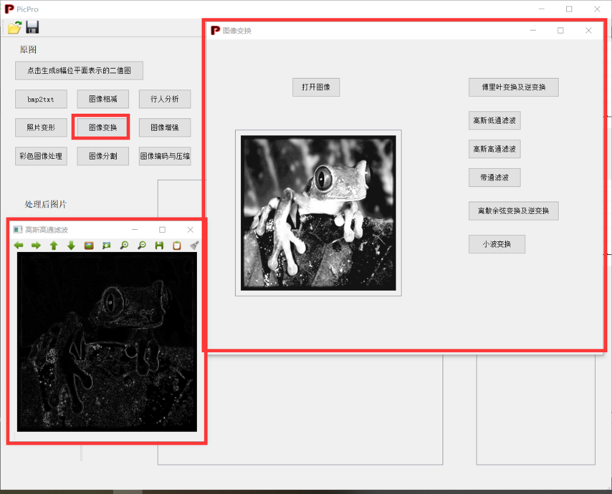

运行软件之后，初始界面如下。图片的打开和保存按钮在左上角，支持\*.png \*.bmp \*.jpg \*.tif \*.GIF格式，但仅支持八位灰度图，打开彩图也会转为灰度图处理。

{width="4.536053149606299in" height="3.6666666666666665in"}

打开图片后界面如下。上半部分显示原图信息，下半部分显示处理后图片及信息。原图大小被固定，处理后图片大小原样显示，超出显示框则会出现滚动条。

{width="4.625in" height="3.7385662729658793in"}

左下角可以进行采样点数、量化等级的改变，点运算，不同直方图均衡，旋转，缩放，水平、垂直移动。有下拉栏的操作从下拉栏中选择要进行的操作种类、有滑动条的则可以滑动。为了更好的展示和避免bug（如滑动缩放条连续叠加缩放），每种操作的效果都是独立的，例如缩放和量化等级改变不会叠加。

右下角可以设置阈值，二值图会实时跟随处理后图像改变。

{width="4.948421916010498in" height="4.0in"}

点击生成八位二值图

{width="5.420994094488189in" height="2.933333333333333in"}

Bmp2txt功能，会根据灰度值大小使用不同的字符代替像素点

{width="6.348217410323709in" height="3.7248665791776028in"}

照片变形，展示一张图片向另一张图片的变形过程

{width="5.44326334208224in" height="4.4in"}

点击弹出图像相减窗口，可加载图片进行图像相减操作。

可以在验证图像中选择不同光强的背景图片进行相减。

{width="4.9484241032370955in" height="4.0in"}

行人分析功能，会自动捕捉视频中的行人，计算其速度和方向（0度为x轴正方向）。视频界面中红色框是软件根据行人位置自动绘制的。

{width="4.587600612423447in" height="3.7083333333333335in"}

图像变换：包括傅里叶变换及逆变换、高斯低通滤波、高斯高通滤波、带通滤波、高斯余弦变换及逆变换、小波变换。

{width="4.733333333333333in" height="3.826132983377078in"}

图像增强：

图像平滑，包括均值滤波、中值滤波和k近邻中值滤波。

{width="4.8556430446194225in" height="3.925in"}

图像锐化，包括拉普拉斯算子、Sobel算子、Prewitt算子。

右上角是任意模板卷积。

{width="5.633333333333334in" height="3.7512587489063867in"}

同态滤波

{width="5.6439566929133855in" height="3.7583333333333333in"}

彩色图像处理：

灰度化

{width="5.691666666666666in" height="4.600792869641295in"}

24位真彩色图像转换为256色彩色图像

{width="5.023523622047244in" height="3.2245603674540684in"}

图像分割：

边缘检测

{width="4.558333333333334in" height="3.684676290463692in"}

边缘闭合

将图中缺口部位闭合

{width="5.946886482939632in" height="4.033333333333333in"}

霍夫变换

检测图中直线并绘制出来

{width="5.30796697287839in" height="3.6in"}

图片编码与压缩：

图片压缩

{width="5.433333333333334in" height="4.391973972003499in"}

Huffman树的生成图形显示

点击按钮，选择灰度图（例lena.bmp），生成对其灰度值编码的Huffman树，并输出信息。

{width="6.949305555555555in" height="2.6896773840769903in"}
